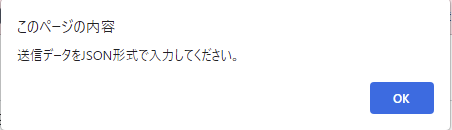

# sipf-simple-websocket-viewer

さくらのモノプラットフォームのWebSocketサービスアダプタ通信を簡易的に確認できるViewerです。

## 設定

さくらのクラウドコントロールパネルで作成したWebSocketサービスアダプタのURLをWebSocket URLに入力します。

Connectを押下し、接続が成功するとViewerの下部に受信メッセージが流れてくることが確認できます。


## 送信

メッセージの送信を確認するためには事前にさくらのクラウドコントロールパネルにてプロジェクトのSIMタブの画面からデバイスIDを確認します。

確認したデバイスIDを使いViewerのテキストエリアにJSON形式のメッセージを入力し、送信ボタンを押下するとメッセージを送信することができます。

送信例（対象デバイスへの8ビット符号なし整数を含むタグ0x01のオブジェクト2件の一括送信）
```json
{
   "device_id":"送りたいデバイスID",
   "type":"object",
   "payload":[
      {
         "type":"uint32",
         "tag":"01",
         "value":1
      },
      {
         "type":"uint32",
         "tag":"01",
         "value":2
      }
   ]
}
```

送信が成功すると受信メッセージにnotifyメッセージが表示され、デバイス側で受信を行うことができるようになります。
```json
{
    "device_id": "送りたいデバイスID",
    "type": "notify",
    "id": "送信ごとに割り当てられるID"
}
```

JSON形式に不備があると、送信ボタンを押下した際にアラートが表示されます。



また、JSON形式は正常でも、各値が所定の範囲を超えている場合はerrorメッセージが表示されます。
送信する各値が定められたものであるか確認してください。

存在しないデバイスIDを指定している
```json
{
    "type": "error",
    "datetime": "YYYY-MM-DDThh:mm:ss.000000000Z",
    "payload": {
        "error": "Invalid device",
        "detail": "'XXXXX' was not found"
    }
}
```

タグに00~FFではない値を指定している
```json
{
    "type": "error",
    "datetime": "YYYY-MM-DDThh:mm:ss.000000000Z",
    "payload": {
        "error": "Validation Error",
        "detail": "Validation Error invalid tag format...XX. tag must be '00' ~ 'FF'"
    }
}
```

payload[].typeに定義されていない型式を指定している
```json
{
    "type": "error",
    "datetime": "YYYY-MM-DDThh:mm:ss.000000000Z",
    "payload": {
        "error": "Validation Error",
        "detail": "Validation Error invalid type...XXXXXX.please set correct type..ex) uint8..uint16"
    }
}
```

payload[].valueに型式に合わない値を指定している
```json
{
    "type": "error",
    "datetime": "YYYY-MM-DDThh:mm:ss.000000000Z",
    "payload": {
        "error": "Validation Error",
        "detail": "Validation Error unmarshall failed, please set correct type and value.value: XXXXXXXXX, type: XXXXXX"
    }
}
```

## 参考情報

[さくらのモノプラットフォームとは](https://manual.sakura.ad.jp/cloud/iotpf/about.html)

[データフォーマット](https://manual.sakura.ad.jp/cloud/iotpf/data-format-beta.html)