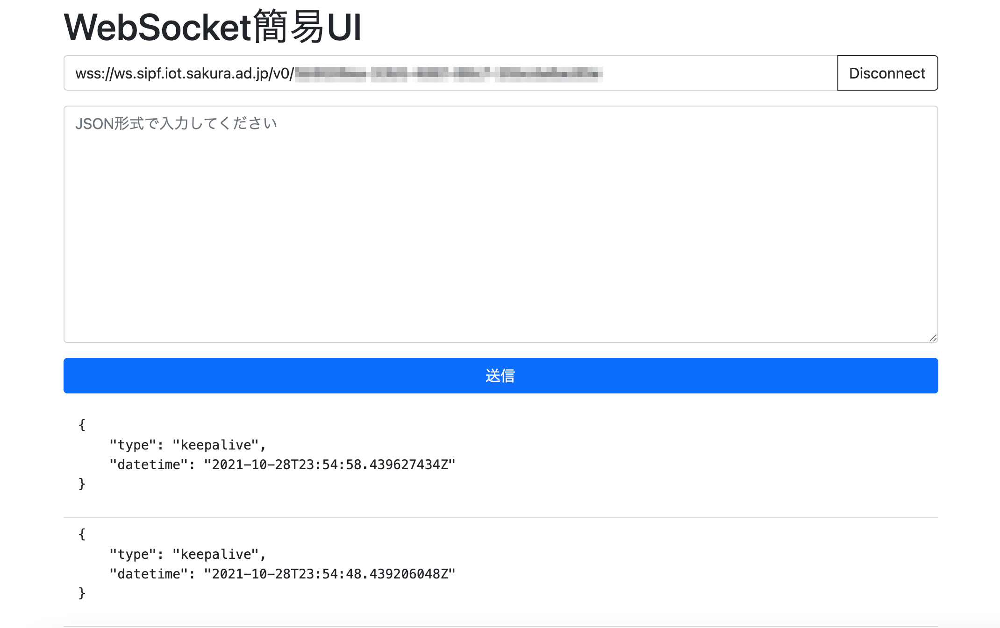

# sipf-simple-websocket-viewer

さくらのモノプラットフォームのWebSocketサービスアダプタ通信を簡易的に確認できるViewerです。

## 設定

さくらのクラウドコントロールパネルで作成したWebSocketサービスアダプタのURLをWebSocket URLに入力します。

Connectを押下し、接続が成功するとViewerの下部に受信メッセージが流れてくることが確認できます。



## 送信

メッセージの送信を確認するためには事前にさくらのクラウドコントロールパネルにてプロジェクトのSIMタブの画面からモジュールIDを確認します。

確認したモジュールIDを使いViewerのテキストエリアに以下のようなメッセージ(JSON形式)を入力し、送信ボタンを押下するとメッセージを送信することができます。

```json
{
   "module_id":"送りたいモジュールID",
   "type":"object",
   "payload":[
      {
         "type":"uint32",
         "tag":"01",
         "value":1
      },
      {
         "type":"uint32",
         "tag":"01",
         "value":2
      }
   ]
}
```

## 参考情報

[さくらのモノプラットフォームとは](https://manual.sakura.ad.jp/cloud/iotpf-beta/about.html)